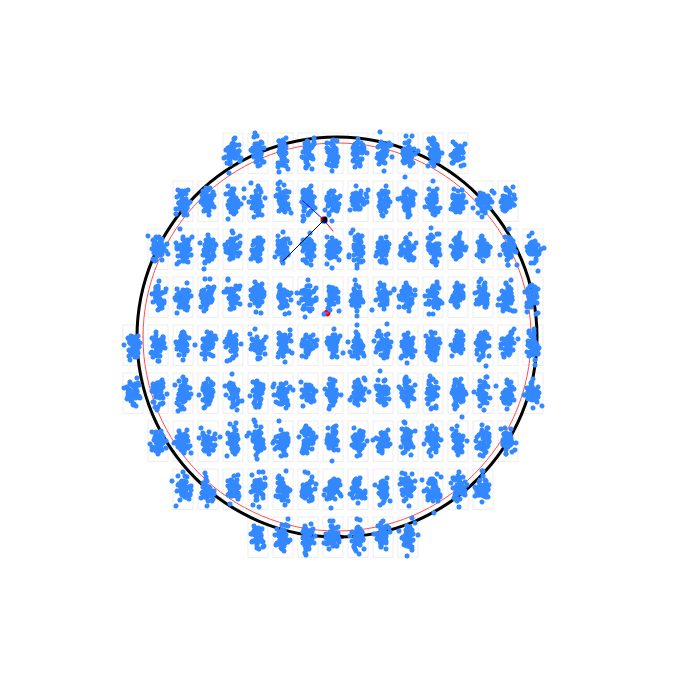

# Wafermap


<p align="center">
<a href="https://pypi.python.org/pypi/wafermap">
    
</a>

<a href="https://github.com/cap1tan/wafermap/actions">
    
</a>

<!-- <a href="https://wafermap.readthedocs.io/en/latest/?badge=latest">
    
</a> -->

</p>


A python package to plot maps of semiconductor wafers.


* Free software: MIT


## Features

* Circular wafers with arbitrary notch orientations.
* Edge-exclusion and grids with optional margin.
* Hover-able points, vectors and images.
* Tooltips with embeddable images.
* Export zoom-able maps to HTML.
* Toggle layers on/off individually.
* Export to png with selenium, geckodriver and Mozilla


## Examples

Save the [demo html](examples/test_wafermap_example.html) file and open in a browser for the scrollable/zoomable version.

Static png image:




## Installation

To install Wafermap, run this command in your
terminal:

``` console
$ pip install wafermap
```

This is the preferred method to install Wafermap, as it will always install the most recent stable release.

If you don't have [pip][] installed, this [Python installation guide][]
can guide you through the process.

### From source

The source for Wafermap can be downloaded from
the [Github repo][].

You can clone the public repository:

``` console
$ git clone git://github.com/cap1tan/wafermap
```


  [pip]: https://pip.pypa.io
  [Python installation guide]: http://docs.python-guide.org/en/latest/starting/installation/
  [Github repo]: https://github.com/%7B%7B%20cookiecutter.github_username%20%7D%7D/%7B%7B%20cookiecutter.project_slug%20%7D%7D


## Usage

To use Wafermap in a project

```python
    import wafermap
```

First let's define a Wafermap:
```python
wm = wafermap.WaferMap(wafer_radius=100e-3,             # all length dimensions in meters
                       cell_size=(10e-3, 20e-3),        # (sizeX, sizeY)
                       cell_margin=(8e-3, 15e-3),       # distance between cell borders (x, y)
                       grid_offset=(-2.05e-3, -4.1e-3), # grid offset in (x, y)
                       edge_exclusion=2.2e-3,           # margin from the wafer edge where a red edge exclusion ring is drawn
                       coverage='full',                 # 'full': will cover wafer with cells, partial cells allowed
                                                        # 'inner': only full cells allowed
                       notch_orientation=270)           # angle of notch in degrees. 270 corresponds to a notch at the bottom
```

To add an image at a specific cell/relative cell coordinates simply:
```python
wm.add_image(image_source_file="inspection1.jpg",
             cell=(1, 0),                               # (cell_index_x, cell_index_y)
             offset=(2.0e-3, 2.0e-3))                   # relative coordinate of the image within the cell
```

Adding vectors is just as easy. Just define cell and \[(start_rel_coordinates), (end_rel_coordinates)\]:
```python
vectors = [
            ((3, 0), [(0, 0), (1e-3, 1e-3)]),
            ((3, 0), [(1e-3, 0), (-5e-3, 5e-3)]),
            ((3, 0), [(0, 1e-3), (10e-3, -10e-3)]),
            ((3, 0), [(1e-3, 1e-3), (-20e-3, -20e-3)]),
            ]
colors = ['green', 'red', 'blue', 'black']
for color, (cell, vector) in zip(colors, vectors):
    wm.add_vector(vector_points=vector, cell=cell, vector_style={'color': color}, root_style={'radius': 1, 'color': color})
```

Let's throw in some points in a normal distribution for good measure too:
```python
# add 50 points per cell, in a random distribution
import random as rnd
cell_size = (10e-3, 20e-3)
cell_points = [(cell, [(rnd.gauss(cell_size[1]/2, cell_size[1]/6), rnd.gauss(cell_size[0]/2, cell_size[0]/6)) for _ in range(50)]) for cell in wm.cell_map.keys()]
for cell, cell_points_ in cell_points:
    for cell_point in cell_points_:
        wm.add_point(cell=cell, offset=cell_point)
```

Finally, nothing would matter if we couldn't see the result:
```python
# save to html
wm.save_html(f"wafermap.html")

# save to png (Mozilla must be installed)
wm.save_png(f"wafermap.png")
```


## Dependencies

- Folium
- branca
- Pillow
- Optional for exporting to .png images: selenium, geckodriver and Mozilla browser installed.


## Contributing

Contributions are welcome, and they are greatly appreciated! Every little bit
helps, and credit will always be given.

You can contribute in many ways:

### Types of Contributions

#### Report Bugs

Report bugs at https://github.com/cap1tan/wafermap/issues.

If you are reporting a bug, please include:

* Your operating system name and version.
* Any details about your local setup that might be helpful in troubleshooting.
* Detailed steps to reproduce the bug.

#### Fix Bugs

Look through the GitHub issues for bugs. Anything tagged with "bug" and "help
wanted" is open to whoever wants to implement it.

#### Implement Features

Look through the GitHub issues for features. Anything tagged with "enhancement"
and "help wanted" is open to whoever wants to implement it.

#### Write Documentation

Wafermap could always use more documentation, whether as part of the
official Wafermap docs, in docstrings, or even on the web in blog posts,
articles, and such.

#### Submit Feedback

The best way to send feedback is to file an issue at https://github.com/cap1tan/wafermap/issues.

If you are proposing a feature:

* Explain in detail how it would work.
* Keep the scope as narrow as possible, to make it easier to implement.
* Remember that this is a volunteer-driven project, and that contributions
  are welcome :)

### Get Started!

Ready to contribute? Here's how to set up `wafermap` for local development.

1. Fork the `wafermap` repo on GitHub.
2. Clone your fork locally

```
    $ git clone git@github.com:your_name_here/wafermap.git
```

3. Ensure [poetry](https://python-poetry.org/docs/) is installed.
4. Install dependencies and start your virtualenv:

```
    $ poetry install -E test -E doc -E dev
```

5. Create a branch for local development:

```
    $ git checkout -b name-of-your-bugfix-or-feature
```

   Now you can make your changes locally.

6. When you're done making changes, check that your changes pass the
   tests, including testing other Python versions, with tox:

```
    $ tox
```

7. Commit your changes and push your branch to GitHub:

```
    $ git add .
    $ git commit -m "Your detailed description of your changes."
    $ git push origin name-of-your-bugfix-or-feature
```

8. Submit a pull request through the GitHub website.

### Pull Request Guidelines

Before you submit a pull request, check that it meets these guidelines:

1. The pull request should include tests.
2. If the pull request adds functionality, the docs should be updated. Put
   your new functionality into a function with a docstring, and add the
   feature to the list in README.md.
3. The pull request should work for Python 3.6, 3.7, 3.8, 3.9 and for PyPy. Check
   https://github.com/cap1tan/wafermap/actions
   and make sure that the tests pass for all supported Python versions.

### Tips
```
    $ python -m unittest tests.test_wafermap
```
To run a subset of tests.


### Deploying

A reminder for the maintainers on how to deploy.
Make sure all your changes are committed (including an entry in HISTORY.md).
Then run:

```
$ poetry patch # possible: major / minor / patch
$ git push
$ git push --tags
```

Github Actions will then deploy to PyPI if tests pass.
